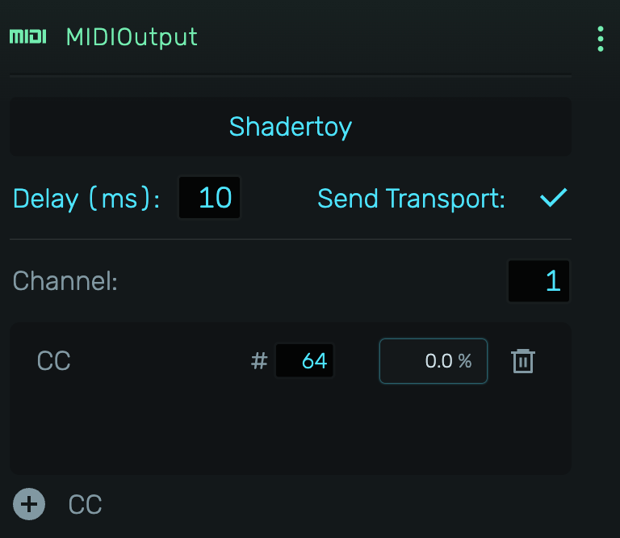

# MIDIOutput

Routes MIDI data to external hardware synthesizers, drum machines, or other MIDI-compatible devices.

---

---

## 0. Overview

_MIDIOutput_ sends MIDI notes, control changes, and transport messages to connected hardware via your computer's MIDI interface. Use it to sequence external gear from your project.

Example uses:

- Controlling hardware synthesizers
- Sequencing drum machines
- Sending CC automation to external effects
- Syncing external gear to transport

---

## 1. Device Selection

Click the device selector to choose from available MIDI output ports. If no devices appear, click "Request MIDI..." to grant browser permission.

Shows "No device selected" when disconnected. Devices that become unavailable are highlighted.

---

## 2. Settings

### 2.1 Delay (ms)

Compensates for latency in your MIDI interface or external device. Range: 0-500ms, default: 10ms. Adjusts the timing of all outgoing MIDI messages including notes, CCs, and clock. Increase if external gear plays late; decrease if it plays early.

### 2.2 Send Transport

When enabled, sends MIDI transport and clock data to the external device:

- **Transport messages**: Start (0xFA), Stop (0xFC), Continue (0xFB)
- **MIDI Clock**: 24 pulses per quarter note (0xF8) synchronized to the project tempo

This allows drum machines, sequencers, and arpeggiators to stay in sync with your project's tempo and playback position.

### 2.3 Channel

MIDI channel for note and CC output (1-16). Set this to match the channel your external device is listening on.

---

## 3. CC Parameters

Click the **{icon:Add} CC** button to add Control Change parameters for automating external gear.

Each CC parameter displays:

- **Label**: Double-click to rename (e.g., "Filter", "Resonance")
- **CC Number**: Controller number 0-127 (e.g., CC 74 for filter cutoff)
- **Value**: Current value 0-127, drag to adjust
- **Delete**: Remove the parameter

CC parameters can be:

- Automated in the timeline like any other parameter
- MIDI-learned from external controllers
- Used to control any CC-assignable parameter on external synthesizers
