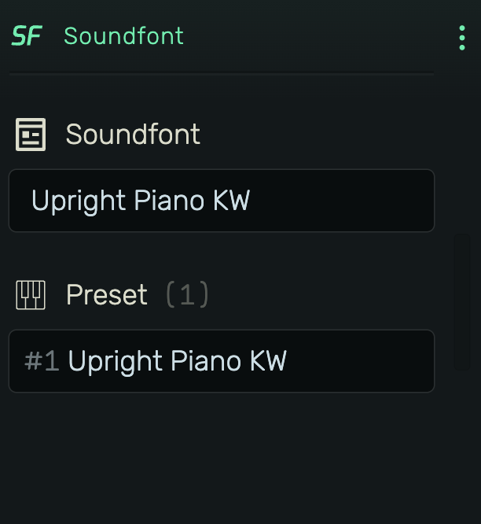

# Soundfont

A sample-based instrument that plays Soundfont (.sf2) files, the widely-used format for multi-sample instrument libraries.

---

---

## 0. Overview

_Soundfont_ loads .sf2 files containing multiple sampled instruments (presets). Select a soundfont, choose a preset, and play it via MIDI. Ideal for realistic pianos, orchestral instruments, and classic GM sounds.

Example uses:

- Realistic acoustic instruments (pianos, strings, brass)
- General MIDI playback
- Classic hardware emulations
- Quick sketching with quality sounds

---

## 1. Soundfont Selector

Click to choose a soundfont from available sources:

- **Stock**: Pre-installed soundfonts from the cloud library
- **Local**: Soundfonts stored in your browser's local storage
- **Import Soundfont...**: Load a .sf2 file from your computer

Shows loading progress when fetching remote soundfonts.

---

## 2. Preset Selector

Each soundfont contains one or more presets (instruments). The header shows the total preset count.

Click to select a preset. Presets are numbered (#1, #2, etc.) with their original names from the soundfont file.

---

## 3. Memory Considerations

Soundfont files can be large (some exceed 1GB). The entire file is loaded into memory for playback.

- **Small files** (<50MB): Load quickly, minimal memory impact
- **Medium files** (50-200MB): May take a moment to load
- **Large files** (>200MB): Can cause memory pressure, especially on devices with limited RAM

If you experience performance issues or crashes, consider using smaller soundfonts or reducing the number of simultaneous Soundfont instruments in your project.
