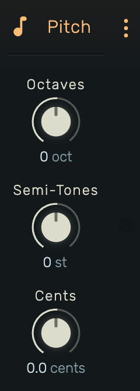

# Pitch

A MIDI note transposition effect with octave, semitone, and fine-tuning control.

---

---

## 0. Overview

_Pitch_ transposes incoming MIDI notes by a specified amount. Combine octave shifts, semitone offsets, and fine cent adjustments for precise pitch control.

Example uses:

- Octave doubling (layer with original)
- Transposing to a different key
- Creating harmonies at fixed intervals
- Micro-tuning adjustments

---

## 1. Octaves

Octave transposition. Range: **-7 to +7 octaves**.

Each octave equals 12 semitones:

- **-7**: 7 octaves down (84 semitones)
- **0**: No octave shift
- **+7**: 7 octaves up (84 semitones)

---

## 2. Semi-Tones

Semitone transposition. Range: **-36 to +36 semitones**.

Fine control within and beyond octaves:

- **-12**: One octave down
- **-7**: Perfect fifth down
- **0**: No transposition
- **+7**: Perfect fifth up
- **+12**: One octave up

---

## 3. Cents

Fine pitch adjustment. Range: **-50.0 to +50.0 cents**.

100 cents equals one semitone. Use for:

- Micro-tuning adjustments
- Detuning for chorus-like effects
- Matching pitch to non-standard tunings

---

## 4. Technical Notes

- Total transposition: `(octaves × 12) + semiTones` semitones, plus cents for fine tuning
- All parameters are automatable
- Parameter values are read at each note's start position
- Original note velocity and duration are preserved
