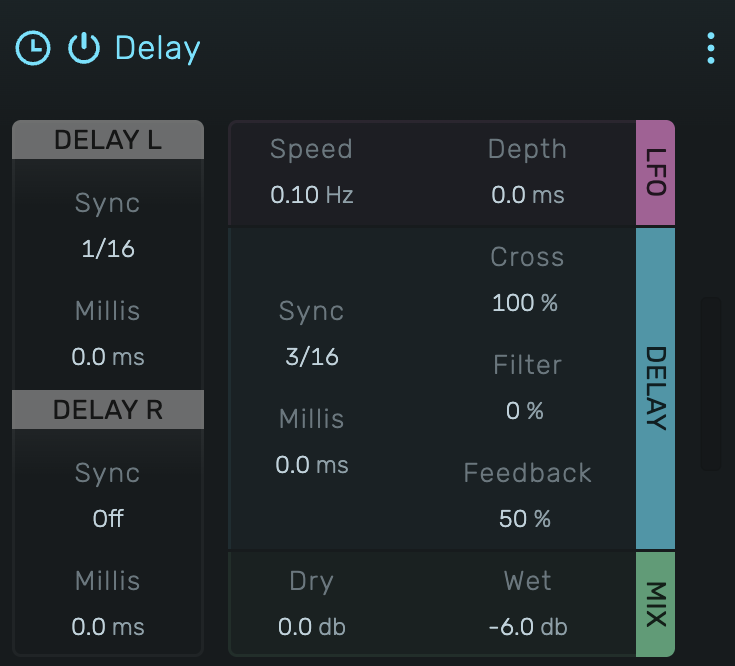

# Delay

A stereo delay with tempo sync or free-running mode, stereo pre-delay, crossfeed for ping-pong effects, LFO modulation, and filtering in the feedback loop.

---

---

## 0. Overview

_Delay_ creates echo effects synchronized to the project tempo or set freely in milliseconds. Features stereo pre-delay for offset between channels, crossfeed for ping-pong patterns, LFO modulation for chorus-like movement, and a filter in the feedback path for evolving repeats.

Example uses:

- Rhythmic echoes synced to tempo
- Ping-pong delay effects
- Filtered dub delays
- Chorus-like modulated delays
- Spatial enhancement with stereo pre-delay

---

## 1. Pre-Delay Left / Right

Independent pre-delay for each stereo channel, creating offset between left and right delay taps. Each channel has two controls:

**Sync (pre sync L / pre sync R)**: Tempo-synced pre-delay as a musical fraction. Set to "Off" to disable sync and use milliseconds instead.

**Milliseconds (pre ms L / pre ms R)**: Free-running pre-delay time. Range: 0 to 1000 ms. Only active when sync is set to "Off".

Use cases:
- Complex rhythmic patterns with different L/R delay timing
- Asymmetric stereo delay effects
- Widening the wet signal's stereo image

---

## 2. Delay Time

Main delay time with two modes:

**Sync (delay)**: Tempo-synced delay time as a musical fraction. Set to "Off" to use milliseconds instead.

**Milliseconds (ms)**: Free-running delay time. Range: 0 to 1000 ms. Only active when sync is set to "Off".

Available musical fractions (ascending):

| Short | Medium | Long |
|-------|--------|------|
| 1/128 | 1/16 | 1/4 |
| 1/96 | 1/12 | 5/16 |
| 1/64 | 3/32 | 1/3 |
| 1/48 | 1/8 | 3/8 |
| 1/32 | 1/6 | 7/16 |
| 1/24 | 3/16 | 1/2 |
| 3/64 | | 1/1 |

Delay time updates smoothly when changed, interpolating over 0.5 seconds to avoid clicks.

---

## 3. Feedback

Amount of delayed signal fed back into the delay line. Range: 0% to 100%.

- **0%**: Single echo, no repeats
- **50%**: Moderate decay, several repeats
- **High values**: Long decay, many repeats

Note: A built-in limiter prevents runaway feedback and clipping at high feedback values.

---

## 4. Cross

Stereo crossfeed amount. Range: 0% to 100%.

- **0%**: No crossfeed. Left input echoes on left, right on right.
- **50%**: Partial crossfeed. Creates stereo movement.
- **100%**: Full crossfeed. Classic ping-pong effect where echoes alternate between left and right.

---

## 5. LFO

Low-frequency oscillator modulating the delay time for chorus-like effects and movement.

**Speed (lfo speed)**: LFO rate. Range: 0.1 Hz to 5.0 Hz (exponential scaling).

**Depth (lfo depth)**: Modulation amount in milliseconds. Range: 0 to 50 ms.

- **0 ms**: No modulation, static delay time
- **Low values (1-5 ms)**: Subtle chorus/doubling effect
- **Higher values**: More pronounced pitch wobble and movement

The LFO uses a triangle waveform for smooth modulation.

---

## 6. Filter

Filter applied to the feedback signal. Range: -100% to +100%.

- **Negative values**: Low-pass filter. Repeats get progressively darker (tape/analog character).
- **0%**: No filtering. Clean repeats.
- **Positive values**: High-pass filter. Repeats get progressively thinner/brighter.

The filter uses an exponential frequency mapping from 20 Hz to 20 kHz, applied within the feedback loop so each repeat is filtered again.

---

## 7. Dry

Level of the original unprocessed signal. Range: -72 dB to 0 dB.

Set to -72 dB for a 100% wet signal, useful on send/return configurations.

---

## 8. Wet

Level of the delayed signal. Range: -72 dB to 0 dB.

Adjust relative to Dry for the desired effect intensity.

---

## 9. Technical Notes

- Delay time is recalculated when tempo changes (sync mode)
- Maximum delay time is 1 second (1000 ms) or 1/1 note at current tempo
- Interpolation prevents clicks when changing delay time during playback
- Built-in limiter with 50 ms attack and 250 ms release prevents clipping
- A small gain reduction (0.96x) is applied in the feedback loop for stability
