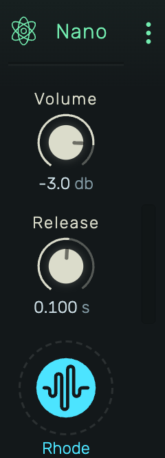

# Nano

A minimal sample playback instrument. Load a single sample and play it chromatically across the keyboard.

---

---

## 0. Overview

_Nano_ is designed for simplicity. Load any audio file, and it becomes a playable instrument mapped across all MIDI notes. The sample is pitch-shifted to match the played note.

Example uses:

- Quick chromatic sampling of any sound
- Simple melodic instruments from single samples
- Sound design experimentation
- Placeholder instruments during composition

---

## 1. Controls

### 1.1 Volume

Output level in dB.

### 1.2 Release

Fade-out time after note-off. Longer values let the sample ring out; shorter values cut it quickly.

---

## 2. Sample Zone

The bottom area displays the loaded sample name and a {icon:Waveform} icon.

- **Click**: Browse for a sample
- **Drag & drop**: Drop an audio file directly onto the zone
- **Right-click**: Context menu for sample options
